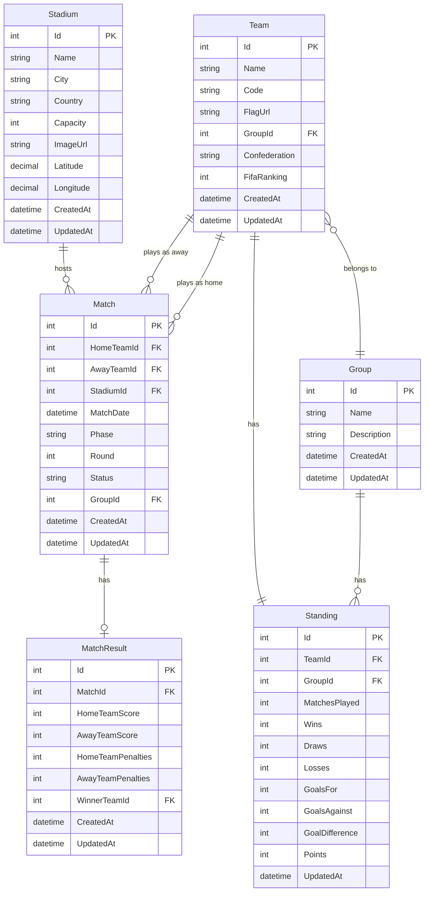

# Database Model - FIFA World Cup 2026 Application

## Entity Relationship Diagram



## Entity Definitions

### 1. Team (Selección)

Represents a national team participating in the World Cup.

**Fields:**
- `Id` (int, PK) - Unique identifier
- `Name` (string, required, max 100) - Team name (e.g., "Argentina", "Brazil")
- `Code` (string, required, max 3) - ISO 3-letter code (e.g., "ARG", "BRA")
- `FlagUrl` (string, nullable, max 500) - URL to flag image
- `GroupId` (int, FK, nullable) - Reference to Group (null for knockout-only teams)
- `Confederation` (string, required, max 50) - CONMEBOL, UEFA, CONCACAF, CAF, AFC, OFC
- `FifaRanking` (int, nullable) - Current FIFA ranking
- `CreatedAt` (datetime, required) - Record creation timestamp
- `UpdatedAt` (datetime, required) - Last update timestamp

**Indexes:**
- Primary Key on `Id`
- Unique Index on `Code`
- Foreign Key Index on `GroupId`

**Relationships:**
- Many-to-One with Group
- One-to-Many with Match (as HomeTeam)
- One-to-Many with Match (as AwayTeam)
- One-to-One with Standing

**Business Rules:**
- Code must be unique
- Name must be unique
- Confederation must be valid
- FIFA ranking must be positive if provided

---

### 2. Group (Grupo)

Represents a group in the group stage.

**Fields:**
- `Id` (int, PK) - Unique identifier
- `Name` (string, required, max 50) - Group name (e.g., "Group A", "Group B")
- `Description` (string, nullable, max 500) - Additional information
- `CreatedAt` (datetime, required) - Record creation timestamp
- `UpdatedAt` (datetime, required) - Last update timestamp

**Indexes:**
- Primary Key on `Id`
- Unique Index on `Name`

**Relationships:**
- One-to-Many with Team
- One-to-Many with Match
- One-to-Many with Standing

**Business Rules:**
- Name must be unique
- Typically 12 groups (A through L) for 48 teams
- Each group should have 4 teams

---

### 3. Stadium (Estadio)

Represents a stadium hosting matches.

**Fields:**
- `Id` (int, PK) - Unique identifier
- `Name` (string, required, max 200) - Stadium name
- `City` (string, required, max 100) - City location
- `Country` (string, required, max 100) - Country (USA, Mexico, or Canada)
- `Capacity` (int, required) - Seating capacity
- `ImageUrl` (string, nullable, max 500) - Stadium image URL
- `Latitude` (decimal, nullable) - Geographic latitude
- `Longitude` (decimal, nullable) - Geographic longitude
- `CreatedAt` (datetime, required) - Record creation timestamp
- `UpdatedAt` (datetime, required) - Last update timestamp

**Indexes:**
- Primary Key on `Id`
- Index on `Country`
- Index on `City`

**Relationships:**
- One-to-Many with Match

**Business Rules:**
- Capacity must be positive
- Country must be USA, Mexico, or Canada
- Coordinates should be valid if provided

---

### 4. Match (Partido)

Represents a match between two teams.

**Fields:**
- `Id` (int, PK) - Unique identifier
- `HomeTeamId` (int, FK, required) - Reference to home team
- `AwayTeamId` (int, FK, required) - Reference to away team
- `StadiumId` (int, FK, required) - Reference to stadium
- `MatchDate` (datetime, required) - Date and time of match
- `Phase` (string/enum, required) - Match phase (see MatchPhase enum)
- `Round` (int, nullable) - Round number (for group stage: 1, 2, 3)
- `GroupId` (int, FK, nullable) - Reference to group (null for knockout)
- `Status` (string/enum, required) - Match status (see MatchStatus enum)
- `CreatedAt` (datetime, required) - Record creation timestamp
- `UpdatedAt` (datetime, required) - Last update timestamp

**Indexes:**
- Primary Key on `Id`
- Foreign Key Index on `HomeTeamId`
- Foreign Key Index on `AwayTeamId`
- Foreign Key Index on `StadiumId`
- Foreign Key Index on `GroupId`
- Index on `MatchDate`
- Index on `Phase`
- Index on `Status`

**Relationships:**
- Many-to-One with Team (HomeTeam)
- Many-to-One with Team (AwayTeam)
- Many-to-One with Stadium
- Many-to-One with Group (nullable)
- One-to-One with MatchResult

**Business Rules:**
- HomeTeamId cannot equal AwayTeamId
- MatchDate must be within tournament dates
- Teams cannot have overlapping matches
- GroupId required for GroupStage phase
- GroupId must be null for knockout phases

---

### 5. MatchResult (Resultado)

Represents the result of a completed match.

**Fields:**
- `Id` (int, PK) - Unique identifier
- `MatchId` (int, FK, required, unique) - Reference to match
- `HomeTeamScore` (int, required) - Home team goals
- `AwayTeamScore` (int, required) - Away team goals
- `HomeTeamPenalties` (int, nullable) - Home team penalty goals (knockout only)
- `AwayTeamPenalties` (int, nullable) - Away team penalty goals (knockout only)
- `WinnerTeamId` (int, FK, nullable) - Reference to winner (null for draws)
- `CreatedAt` (datetime, required) - Record creation timestamp
- `UpdatedAt` (datetime, required) - Last update timestamp

**Indexes:**
- Primary Key on `Id`
- Unique Foreign Key Index on `MatchId`
- Foreign Key Index on `WinnerTeamId`

**Relationships:**
- One-to-One with Match
- Many-to-One with Team (Winner)

**Business Rules:**
- Scores must be non-negative
- WinnerTeamId must be HomeTeamId or AwayTeamId
- Penalties only allowed for knockout phase
- Knockout matches must have a winner
- Group stage matches can end in draws

---

### 6. Standing (Tabla de Posiciones)

Represents a team's standing in their group.

**Fields:**
- `Id` (int, PK) - Unique identifier
- `TeamId` (int, FK, required) - Reference to team
- `GroupId` (int, FK, required) - Reference to group
- `MatchesPlayed` (int, required, default 0) - Total matches played
- `Wins` (int, required, default 0) - Matches won
- `Draws` (int, required, default 0) - Matches drawn
- `Losses` (int, required, default 0) - Matches lost
- `GoalsFor` (int, required, default 0) - Goals scored
- `GoalsAgainst` (int, required, default 0) - Goals conceded
- `GoalDifference` (int, computed) - GoalsFor - GoalsAgainst
- `Points` (int, computed) - (Wins × 3) + Draws
- `UpdatedAt` (datetime, required) - Last update timestamp

**Indexes:**
- Primary Key on `Id`
- Unique Index on (TeamId, GroupId)
- Foreign Key Index on `TeamId`
- Foreign Key Index on `GroupId`
- Index on `Points` (for sorting)

**Relationships:**
- Many-to-One with Team
- Many-to-One with Group

**Business Rules:**
- TeamId + GroupId must be unique
- MatchesPlayed = Wins + Draws + Losses
- All numeric fields must be non-negative
- Points = (Wins × 3) + Draws
- GoalDifference = GoalsFor - GoalsAgainst

---

## Enumerations

### MatchPhase
```csharp
public enum MatchPhase
{
    GroupStage = 1,
    RoundOf32 = 2,
    RoundOf16 = 3,
    QuarterFinals = 4,
    SemiFinals = 5,
    ThirdPlace = 6,
    Final = 7
}
```

### MatchStatus
```csharp
public enum MatchStatus
{
    Scheduled = 1,
    Live = 2,
    Finished = 3,
    Postponed = 4,
    Cancelled = 5
}
```

### Confederation
```csharp
public enum Confederation
{
    UEFA = 1,      // Europe
    CONMEBOL = 2,  // South America
    CONCACAF = 3,  // North/Central America & Caribbean
    CAF = 4,       // Africa
    AFC = 5,       // Asia
    OFC = 6        // Oceania
}
```

---

## Database Constraints

### Foreign Key Constraints

1. **Team.GroupId → Group.Id**
   - ON DELETE: SET NULL
   - Allows teams to exist without a group

2. **Match.HomeTeamId → Team.Id**
   - ON DELETE: RESTRICT
   - Cannot delete team with scheduled matches

3. **Match.AwayTeamId → Team.Id**
   - ON DELETE: RESTRICT
   - Cannot delete team with scheduled matches

4. **Match.StadiumId → Stadium.Id**
   - ON DELETE: RESTRICT
   - Cannot delete stadium with scheduled matches

5. **Match.GroupId → Group.Id**
   - ON DELETE: SET NULL
   - Allows matches to exist without group reference

6. **MatchResult.MatchId → Match.Id**
   - ON DELETE: CASCADE
   - Delete result when match is deleted

7. **MatchResult.WinnerTeamId → Team.Id**
   - ON DELETE: SET NULL
   - Preserve result even if team is deleted

8. **Standing.TeamId → Team.Id**
   - ON DELETE: CASCADE
   - Delete standing when team is deleted

9. **Standing.GroupId → Group.Id**
   - ON DELETE: CASCADE
   - Delete standings when group is deleted

### Check Constraints

1. **Team.FifaRanking** ≥ 1 (if not null)
2. **Stadium.Capacity** > 0
3. **Match.HomeTeamId** ≠ **Match.AwayTeamId**
4. **MatchResult.HomeTeamScore** ≥ 0
5. **MatchResult.AwayTeamScore** ≥ 0
6. **MatchResult.HomeTeamPenalties** ≥ 0 (if not null)
7. **MatchResult.AwayTeamPenalties** ≥ 0 (if not null)
8. **Standing.MatchesPlayed** ≥ 0
9. **Standing.Wins** ≥ 0
10. **Standing.Draws** ≥ 0
11. **Standing.Losses** ≥ 0
12. **Standing.GoalsFor** ≥ 0
13. **Standing.GoalsAgainst** ≥ 0

### Unique Constraints

1. **Team.Code** - Unique
2. **Team.Name** - Unique
3. **Group.Name** - Unique
4. **MatchResult.MatchId** - Unique
5. **(Standing.TeamId, Standing.GroupId)** - Unique composite

---

## Indexes for Performance

### Primary Indexes (Automatic)
- All primary keys have clustered indexes

### Foreign Key Indexes
- All foreign keys have non-clustered indexes

### Additional Indexes

1. **Match.MatchDate** - For date-based queries
2. **Match.Phase** - For phase filtering
3. **Match.Status** - For status filtering
4. **Standing.Points** - For standings sorting
5. **Team.Code** - For quick lookups
6. **Stadium.Country** - For country filtering

---

## Calculated Fields

### Standing Table
- **GoalDifference** = GoalsFor - GoalsAgainst
- **Points** = (Wins × 3) + Draws

These can be:
1. Computed columns in the database
2. Calculated in the application layer
3. Stored and updated via triggers

**Recommendation:** Calculate in application layer for flexibility.

---

## Data Integrity Rules

### Match Validation
1. Home team ≠ Away team
2. Match date within tournament period
3. No overlapping matches for same team
4. Group matches must have GroupId
5. Knockout matches must not have GroupId

### Result Validation
1. Result can only exist for finished matches
2. Scores must be non-negative
3. Winner must be one of the two teams
4. Penalties only for knockout phase
5. Knockout must have winner (no draws)

### Standing Validation
1. MatchesPlayed = Wins + Draws + Losses
2. All counts must be non-negative
3. Points correctly calculated
4. Goal difference correctly calculated

---

## Sample Data Structure

### Groups (12 groups for 48 teams)
```
Group A, Group B, Group C, Group D,
Group E, Group F, Group G, Group H,
Group I, Group J, Group K, Group L
```

### Match Phases
```
1. Group Stage (48 matches - 3 per team)
2. Round of 32 (16 matches)
3. Round of 16 (8 matches)
4. Quarter Finals (4 matches)
5. Semi Finals (2 matches)
6. Third Place (1 match)
7. Final (1 match)
Total: 104 matches
```

### Tournament Structure
- **48 teams** divided into **12 groups** of **4 teams** each
- Each team plays **3 group stage matches**
- Top **2 teams** from each group advance (24 teams)
- **8 best third-place teams** also advance (32 teams total)
- **Knockout stage** from Round of 32 to Final

---

## Migration Strategy

### Initial Migration
1. Create all tables
2. Add foreign key constraints
3. Add check constraints
4. Create indexes
5. Seed initial data (groups, stadiums)

### Seed Data Order
1. Groups
2. Stadiums
3. Teams
4. Standings (empty, one per team)
5. Matches (scheduled)
6. Results (as matches are played)

---

## PostgreSQL Specific Considerations

### Data Types
- `int` → `INTEGER`
- `string` → `VARCHAR(n)` or `TEXT`
- `datetime` → `TIMESTAMP WITH TIME ZONE`
- `decimal` → `NUMERIC(precision, scale)`
- `bool` → `BOOLEAN`

### Sequences
- Auto-increment IDs use `SERIAL` or `IDENTITY`

### JSON Support
- PostgreSQL supports JSON/JSONB for flexible data
- Could store additional match statistics as JSON

### Full-Text Search
- Can add full-text search on team names
- Useful for search functionality

---

## Backup and Recovery

### Backup Strategy
1. Daily automated backups
2. Transaction log backups
3. Point-in-time recovery capability
4. Test restore procedures regularly

### Data Retention
- Keep all historical data
- Archive old tournaments
- Maintain audit trail

---

## Future Enhancements

### Potential Additional Tables

1. **Player**
   - Id, Name, TeamId, Position, Number, etc.

2. **MatchEvent**
   - Id, MatchId, EventType (Goal, Card, Substitution)
   - Minute, PlayerId, etc.

3. **User**
   - Id, Username, Email, PasswordHash
   - For authentication

4. **Prediction**
   - Id, UserId, MatchId, PredictedScore
   - For user predictions

5. **Statistics**
   - Id, TeamId/PlayerId, various stats
   - For detailed analytics

6. **News**
   - Id, Title, Content, PublishedDate
   - For news articles

These can be added in future iterations without breaking existing functionality.