# Proyecto: Aplicación Web Asistida por IA

Estudiante: Allan Acosta Porras <br>
Correo: aacostap@ucenfotec.ac.cr

## Tabla de Contenidos

- [Introducción](#introducción)
- [Arquitectura](#arquitectura)
- [Navegación de Páginas](#navegación-de-páginas)
  - [Flujo Principal de Navegación](#flujo-principal-de-navegación)
  - [Jerarquía de Páginas](#jerarquía-de-páginas)
  - [Relaciones Entre Páginas de Detalle](#relaciones-entre-páginas-de-detalle)
  - [Tabla de Rutas](#tabla-de-rutas)
- [Aplicación](#aplicación)
  - [Dashboard](#dashboard)
  - [Equipos](#equipos)
  - [Detalles de Partidas](#detalles-de-partidas)
  - [Estadios](#estadios)
  - [Grupos](#grupos)
  - [Partidos](#partidos)
  - [Posiciones](#posiciones)
- [Front End](#front-end)
  - [Tecnologías Principales](#tecnologías-principales)
  - [Arquitectura del Frontend](#arquitectura-del-frontend)
  - [Estructura de Carpetas](#estructura-de-carpetas)
  - [Características Principales](#características-principales)
  - [Testing](#testing)
- [Back End](#back-end)
  - [Tecnologías Principales](#tecnologías-principales-1)
  - [Arquitectura en Capas](#arquitectura-en-capas)
  - [Estructura de Proyectos](#estructura-de-proyectos)
  - [Entidades Principales](#entidades-principales)
  - [Controladores REST](#controladores-rest)
  - [Características Principales](#características-principales-1)
  - [Endpoints Principales](#endpoints-principales)
  - [Documentación API](#documentación-api)
  - [Testing](#testing-1)
- [CICD](#cicd)
- [Docker](#docker)
- [Documentación](#documentación)

---

## Introducción

El siguiento documento se elaboró con el objetivo de elaborar una aplicación Web. A lo largo de su desarrollo, se explica como fue aplicada la Inteligencia Artificial en cada una de sus etaps.

## Arquitectura

La arquitectura consiste en la interfaz desarrollada en React. El Back End desde .NET 9. Finalmente la base de datos correr bajo SQLite

```
┌─────────────────────────────────────────────────────────────┐
│                         Frontend (React)                    │
│  ┌──────────────┐  ┌──────────────┐  ┌──────────────┐       │
│  │   Pages      │  │  Components  │  │   Services   │       │
│  └──────────────┘  └──────────────┘  └──────────────┘       │
└─────────────────────────────────────────────────────────────┘
                            │ HTTP/REST
                            ▼
┌─────────────────────────────────────────────────────────────┐
│                    Backend (.NET 9 API)                     │
│  ┌──────────────────────────────────────────────────────┐   │
│  │              Presentation Layer                      │   │
│  │  Controllers, DTOs, Filters, Middleware              │   │
│  └──────────────────────────────────────────────────────┘   │
│                            │                                │
│  ┌──────────────────────────────────────────────────────┐   │
│  │              Application Layer                       │   │
│  │  Services, Business Logic, Validators                │   │
│  └──────────────────────────────────────────────────────┘   │
│                            │                                │
│  ┌──────────────────────────────────────────────────────┐   │
│  │              Domain Layer                            │   │
│  │  Entities, Interfaces, Domain Logic                  │   │
│  └──────────────────────────────────────────────────────┘   │
│                            │                                │
│  ┌──────────────────────────────────────────────────────┐   │
│  │              Infrastructure Layer                    │   │
│  │  DbContext, Repositories, External Services          │   │
│  └──────────────────────────────────────────────────────┘   │
└─────────────────────────────────────────────────────────────┘
                            │
                            ▼
                    ┌───────────────┐
                    │ SQLite/       │
                    │ PostgreSQL    │
                    └───────────────┘
```

## Navegación de Páginas

### Flujo Principal de Navegación

```mermaid
graph TD
    Root["/"] -->|Redirects| Dashboard["/dashboard<br/>📊 Dashboard"]
    
    Dashboard -->|Navigate| Teams["/teams<br/>🚩 Teams List"]
    Dashboard -->|Navigate| Groups["/groups<br/>👥 Groups List"]
    Dashboard -->|Navigate| Matches["/matches<br/>⚽ Matches List"]
    Dashboard -->|Navigate| Stadiums["/stadiums<br/>🏟️ Stadiums List"]
    Dashboard -->|Navigate| Standings["/standings<br/>🏆 Standings"]
    
    Teams -->|Click Team| TeamDetails["/teams/:id<br/>Team Details"]
    Groups -->|Click Group| GroupDetails["/groups/:id<br/>Group Details"]
    Matches -->|Click Match| MatchDetails["/matches/:id<br/>Match Details"]
    Stadiums -->|Click Stadium| StadiumDetails["/stadiums/:id<br/>Stadium Details"]
    
    TeamDetails -->|View Group| GroupDetails
    TeamDetails -->|View Matches| MatchDetails
    TeamDetails -->|Back| Teams
    
    GroupDetails -->|View Team| TeamDetails
    GroupDetails -->|View Match| MatchDetails
    GroupDetails -->|Back| Groups
    
    MatchDetails -->|View Home Team| TeamDetails
    MatchDetails -->|View Away Team| TeamDetails
    MatchDetails -->|View Stadium| StadiumDetails
    MatchDetails -->|View Group| GroupDetails
    MatchDetails -->|Back| Matches
    
    StadiumDetails -->|View Match| MatchDetails
    StadiumDetails -->|Back| Stadiums
    
    Standings -->|View Team| TeamDetails
    Standings -->|View Group| GroupDetails
    
    InvalidRoute["/* (Invalid Route)"] -->|404| NotFound["/404<br/>❌ Not Found"]
    NotFound -->|Go Home| Dashboard
    
    style Dashboard fill:#696cff,stroke:#333,stroke-width:3px,color:#fff
    style Teams fill:#03c3ec,stroke:#333,stroke-width:2px,color:#fff
    style Groups fill:#03c3ec,stroke:#333,stroke-width:2px,color:#fff
    style Matches fill:#03c3ec,stroke:#333,stroke-width:2px,color:#fff
    style Stadiums fill:#03c3ec,stroke:#333,stroke-width:2px,color:#fff
    style Standings fill:#03c3ec,stroke:#333,stroke-width:2px,color:#fff
    style TeamDetails fill:#8b5cf6,stroke:#333,stroke-width:2px,color:#fff
    style GroupDetails fill:#8b5cf6,stroke:#333,stroke-width:2px,color:#fff
    style MatchDetails fill:#8b5cf6,stroke:#333,stroke-width:2px,color:#fff
    style StadiumDetails fill:#8b5cf6,stroke:#333,stroke-width:2px,color:#fff
    style NotFound fill:#ef4444,stroke:#333,stroke-width:2px,color:#fff
```

### Jerarquía de Páginas

```mermaid
graph LR
    subgraph MainLayout["🎯 Main Layout (Sidebar + Header)"]
        Nav["Navigation Menu"]
    end
    
    subgraph Pages["📄 Pages"]
        direction TB
        
        subgraph Dashboard_Section["Dashboard Section"]
            D1["Dashboard<br/>/dashboard<br/>📊 Overview & Stats"]
        end
        
        subgraph Teams_Section["Teams Section"]
            T1["Teams List<br/>/teams<br/>🚩 All Teams"]
            T2["Team Details<br/>/teams/:id<br/>📋 Team Info"]
            T1 --> T2
        end
        
        subgraph Groups_Section["Groups Section"]
            G1["Groups List<br/>/groups<br/>👥 All Groups"]
            G2["Group Details<br/>/groups/:id<br/>📊 Group Standings"]
            G1 --> G2
        end
        
        subgraph Matches_Section["Matches Section"]
            M1["Matches List<br/>/matches<br/>⚽ All Matches"]
            M2["Match Details<br/>/matches/:id<br/>🎯 Match Info"]
            M1 --> M2
        end
        
        subgraph Stadiums_Section["Stadiums Section"]
            S1["Stadiums List<br/>/stadiums<br/>🏟️ All Stadiums"]
            S2["Stadium Details<br/>/stadiums/:id<br/>📍 Stadium Info"]
            S1 --> S2
        end
        
        subgraph Standings_Section["Standings Section"]
            ST1["Standings<br/>/standings<br/>🏆 Tournament Standings"]
        end
        
        subgraph Error_Section["Error Handling"]
            E1["404 Not Found<br/>/*<br/>❌ Invalid Route"]
        end
    end
    
    Nav --> D1
    Nav --> T1
    Nav --> G1
    Nav --> M1
    Nav --> S1
    Nav --> ST1
    
    style MainLayout fill:#2b2c40,stroke:#696cff,stroke-width:3px,color:#fff
    style Dashboard_Section fill:#1a1b2e,stroke:#696cff,stroke-width:2px
    style Teams_Section fill:#1a1b2e,stroke:#03c3ec,stroke-width:2px
    style Groups_Section fill:#1a1b2e,stroke:#03c3ec,stroke-width:2px
    style Matches_Section fill:#1a1b2e,stroke:#03c3ec,stroke-width:2px
    style Stadiums_Section fill:#1a1b2e,stroke:#03c3ec,stroke-width:2px
    style Standings_Section fill:#1a1b2e,stroke:#03c3ec,stroke-width:2px
    style Error_Section fill:#1a1b2e,stroke:#ef4444,stroke-width:2px
```

### Relaciones Entre Páginas de Detalle

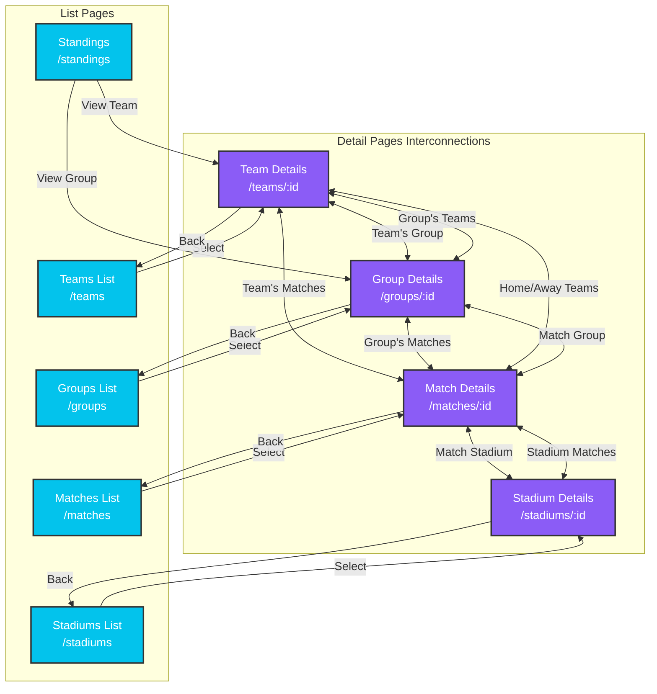

### Tabla de Rutas

| Ruta | Página | Tipo | Descripción |
|------|--------|------|-------------|
| `/` | Root | Redirect | Redirige a `/dashboard` |
| `/dashboard` | Dashboard | Principal | Vista general con estadísticas |
| `/teams` | Teams List | Lista | Todos los equipos participantes |
| `/teams/:id` | Team Details | Detalle | Información del equipo, roster, partidos |
| `/groups` | Groups List | Lista | Todos los grupos del torneo (A-L) |
| `/groups/:id` | Group Details | Detalle | Posiciones, equipos y partidos del grupo |
| `/matches` | Matches List | Lista | Todos los partidos con filtros |
| `/matches/:id` | Match Details | Detalle | Info del partido, marcador, equipos, estadio |
| `/stadiums` | Stadiums List | Lista | Todos los estadios del torneo |
| `/stadiums/:id` | Stadium Details | Detalle | Info del estadio, ubicación, partidos |
| `/standings` | Standings | Global | Posiciones generales del torneo |
| `/*` | Not Found | Error | Página 404 para rutas inválidas |

## Páginas

### Dashboard
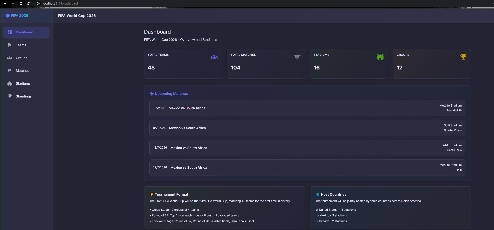

### Equipos
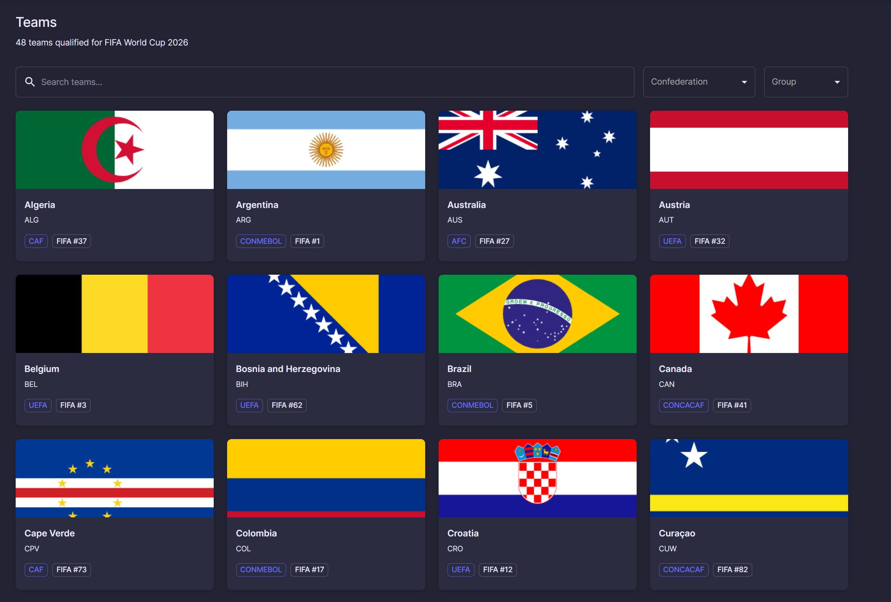

### Detalles de Partidas
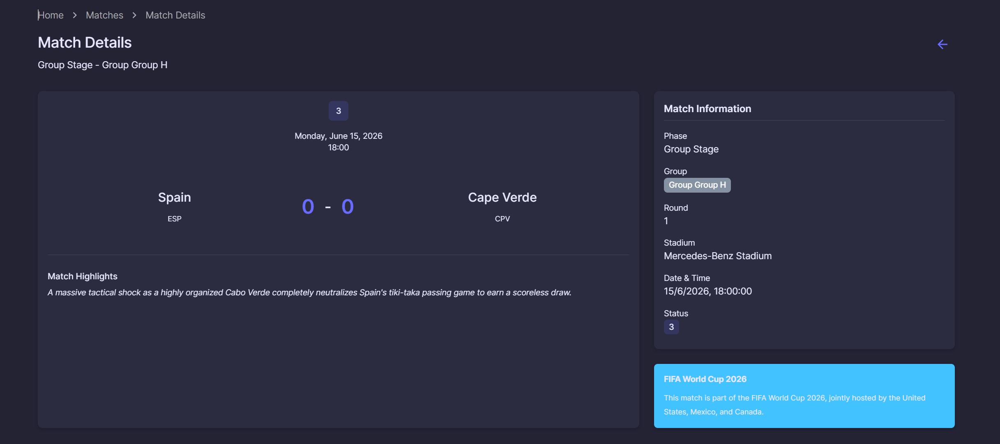

### Estadios
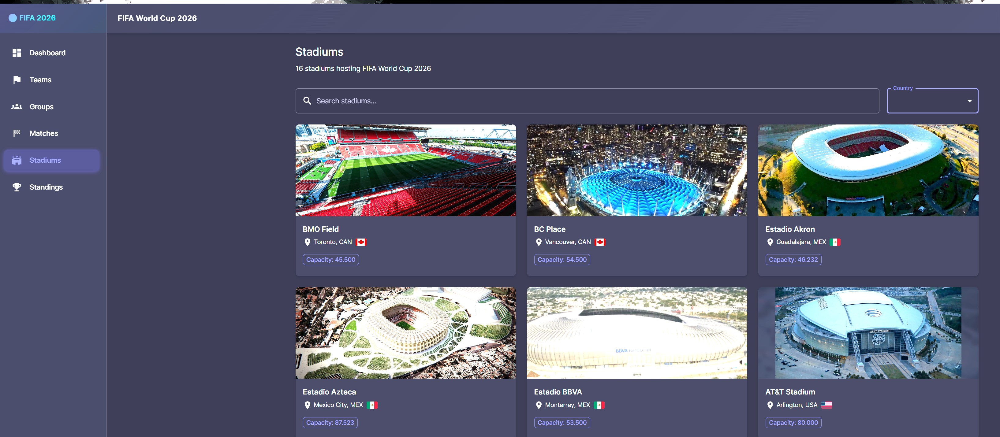

### Grupos
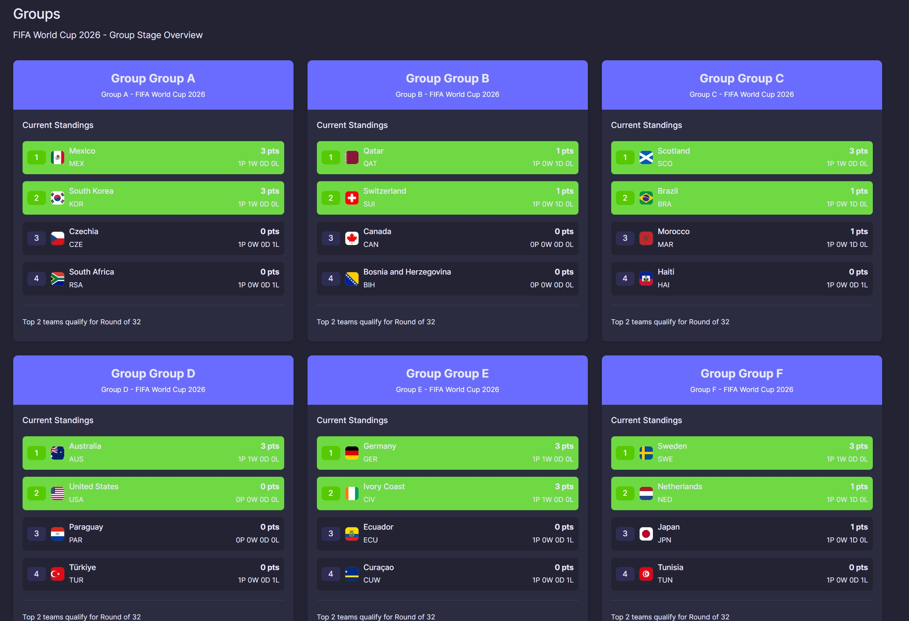

### Partidos
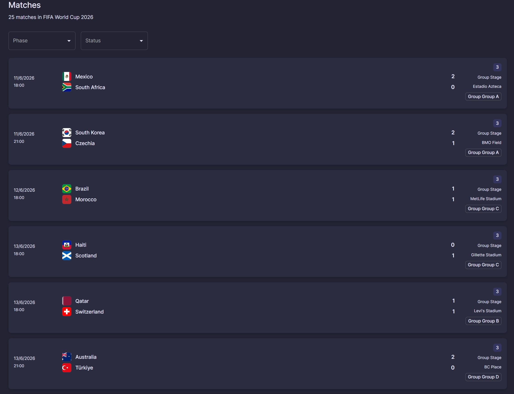

### Posiciones
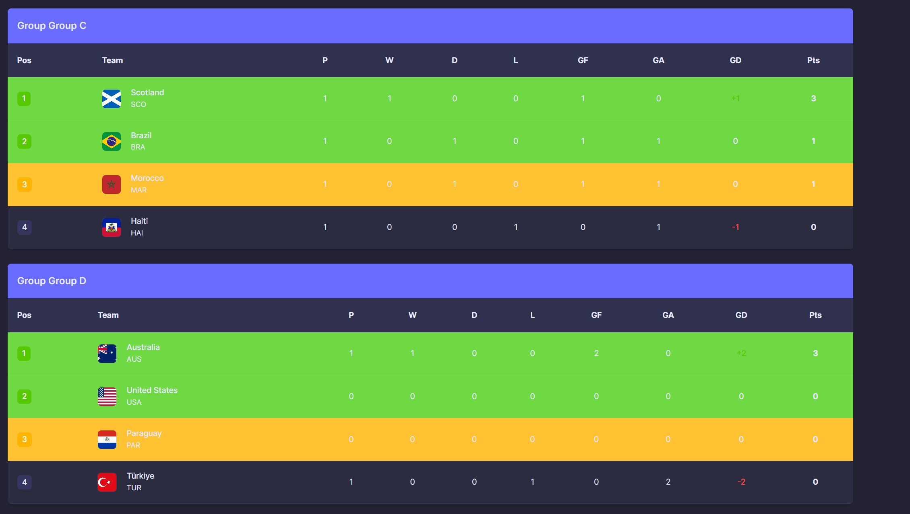


El Front End de la aplicación está desarrollado con tecnologías modernas de React, proporcionando una interfaz de usuario interactiva y responsiva para gestionar el Mundial de Fútbol 2026.

### Tecnologías Principales

```json
{
  "react": "^19.2.6",
  "react-dom": "^19.2.6",
  "react-router-dom": "^7.16.0",
  "@mui/material": "^9.0.1",
  "@tanstack/react-query": "^5.100.14",
  "axios": "^1.16.1",
  "vite": "^8.0.12",
  "typescript": "~6.0.2"
}
```

### Arquitectura del Frontend

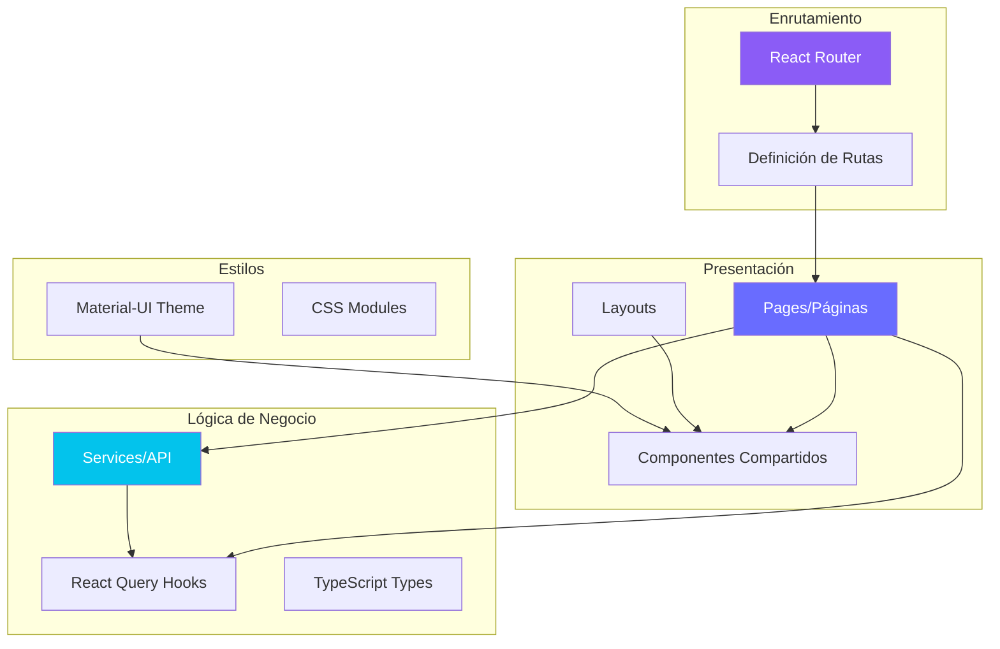

### Estructura de Carpetas

```
frontend/src/
├── assets/          # Imágenes y recursos estáticos
├── components/      # Componentes reutilizables
│   └── shared/      # Componentes compartidos (Loading, ErrorMessage, etc.)
├── config/          # Configuración (API client)
├── layouts/         # Layouts de la aplicación (MainLayout)
├── pages/           # Páginas de la aplicación
│   ├── Dashboard/
│   ├── Teams/
│   ├── Groups/
│   ├── Matches/
│   ├── Stadiums/
│   ├── Standings/
│   └── NotFound/
├── routes/          # Configuración de rutas
├── services/        # Servicios de API
│   └── api/         # Servicios específicos por entidad
├── theme/           # Tema de Material-UI
├── types/           # Definiciones de TypeScript
└── test/            # Utilidades de testing
```

### Características Principales

#### 1. **Gestión de Estado con React Query**
```typescript
// Ejemplo de uso de React Query para obtener equipos
const { data: teams, isLoading, error } = useQuery({
  queryKey: ['teams', pageNumber],
  queryFn: () => teamsService.getAll(pageNumber, pageSize)
});
```

#### 2. **Servicios API Modulares**
```typescript
// teams.service.ts
export const teamsService = {
  getAll: async (pageNumber = 1, pageSize = 10) => {
    const response = await apiClient.get<PagedResult<TeamDto>>('/Teams', {
      params: { pageNumber, pageSize },
    });
    return response.data;
  },
  getById: async (id: number) => {
    const response = await apiClient.get<TeamDto>(`/Teams/${id}`);
    return response.data;
  },
  // ... más métodos
};
```

#### 3. **Componentes Reutilizables**
- **Loading**: Indicador de carga con animaciones
- **ErrorMessage**: Manejo consistente de errores
- **StatCard**: Tarjetas de estadísticas para el dashboard
- **PageHeader**: Encabezados consistentes en todas las páginas

#### 4. **Navegación con React Router**
- Rutas anidadas para mejor organización
- Navegación programática
- Protección de rutas
- Página 404 personalizada

#### 5. **Material-UI para Diseño**
- Tema personalizado con colores del Mundial
- Componentes responsivos
- Modo oscuro por defecto
- Iconos consistentes

### Testing

El frontend incluye pruebas unitarias con Vitest y React Testing Library:

```bash
npm run test              # Ejecutar pruebas
npm run test:coverage     # Cobertura de código
npm run test:ui          # Interfaz visual de pruebas
```

El Back End está desarrollado con .NET 9, siguiendo una arquitectura limpia (Clean Architecture) con separación de responsabilidades en capas bien definidas.

### Tecnologías Principales

- **.NET 9**: Framework principal
- **Entity Framework Core**: ORM para acceso a datos
- **SQLite**: Base de datos
- **AutoMapper**: Mapeo de objetos
- **FluentValidation**: Validación de DTOs
- **Swagger/OpenAPI**: Documentación de API

### Arquitectura en Capas

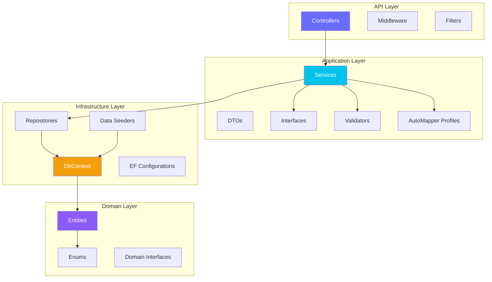

### Estructura de Proyectos

```
backend/src/
├── WorldCup2026.API/              # Capa de Presentación
│   ├── Controllers/               # Controladores REST
│   ├── Program.cs                 # Configuración de la aplicación
│   └── appsettings.json          # Configuración
│
├── WorldCup2026.Application/      # Capa de Aplicación
│   ├── DTOs/                      # Data Transfer Objects
│   ├── Interfaces/                # Interfaces de servicios
│   ├── Mappings/                  # Perfiles de AutoMapper
│   ├── Services/                  # Lógica de negocio
│   └── Validators/                # Validadores FluentValidation
│
├── WorldCup2026.Domain/           # Capa de Dominio
│   ├── Entities/                  # Entidades del dominio
│   ├── Enums/                     # Enumeraciones
│   └── Interfaces/                # Interfaces de repositorios
│
└── WorldCup2026.Infrastructure/   # Capa de Infraestructura
    ├── Data/
    │   ├── Configurations/        # Configuraciones EF Core
    │   ├── Seeding/              # Seeders de datos
    │   └── WorldCupDbContext.cs  # Contexto de base de datos
    ├── Repositories/              # Implementación de repositorios
    └── Migrations/                # Migraciones de base de datos
```

### Entidades Principales

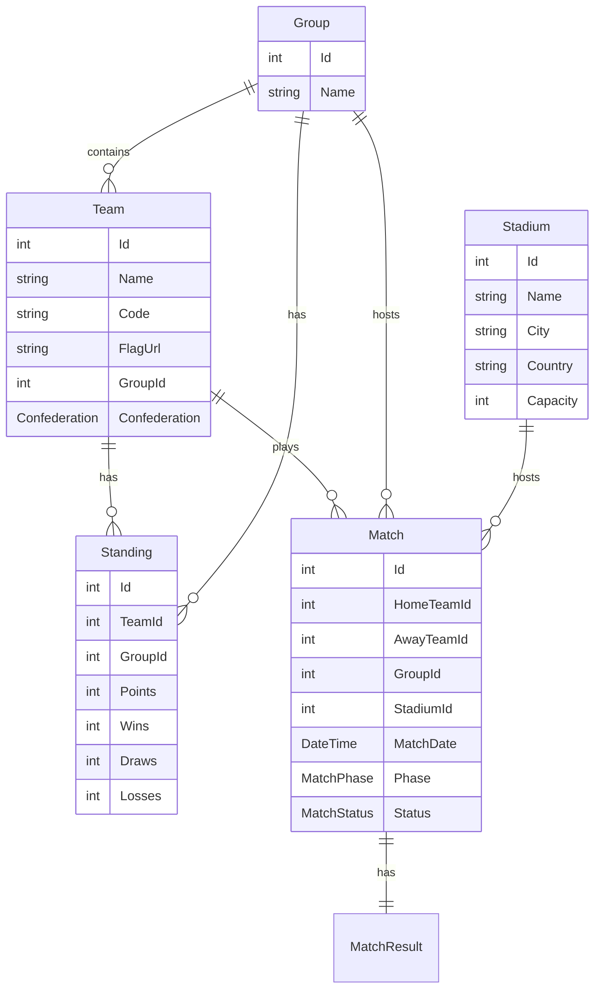

### Controladores REST

Cada controlador proporciona endpoints RESTful completos:

```csharp
[ApiController]
[Route("api/[controller]")]
public class TeamsController : ControllerBase
{
    [HttpGet]                              // GET /api/teams
    [HttpGet("{id}")]                      // GET /api/teams/5
    [HttpGet("code/{code}")]               // GET /api/teams/code/ARG
    [HttpGet("group/{groupId}")]           // GET /api/teams/group/1
    [HttpGet("confederation/{conf}")]      // GET /api/teams/confederation/CONMEBOL
    [HttpPost]                             // POST /api/teams
    [HttpPut("{id}")]                      // PUT /api/teams/5
    [HttpDelete("{id}")]                   // DELETE /api/teams/5
}
```

### Características Principales

#### 1. **Inyección de Dependencias**
```csharp
// Program.cs
builder.Services.AddScoped<ITeamRepository, TeamRepository>();
builder.Services.AddScoped<ITeamService, TeamService>();
builder.Services.AddScoped<IUnitOfWork, UnitOfWork>();
```

#### 2. **Validación con FluentValidation**
```csharp
public class CreateTeamDtoValidator : AbstractValidator<CreateTeamDto>
{
    public CreateTeamDtoValidator()
    {
        RuleFor(x => x.Name).NotEmpty().MaximumLength(100);
        RuleFor(x => x.Code).NotEmpty().Length(3);
        RuleFor(x => x.GroupId).GreaterThan(0);
    }
}
```

#### 3. **Mapeo con AutoMapper**
```csharp
public class MappingProfile : Profile
{
    public MappingProfile()
    {
        CreateMap<Team, TeamDto>();
        CreateMap<CreateTeamDto, Team>();
        CreateMap<UpdateTeamDto, Team>();
    }
}
```

#### 4. **Patrón Repository y Unit of Work**
```csharp
public interface IUnitOfWork : IDisposable
{
    ITeamRepository Teams { get; }
    IGroupRepository Groups { get; }
    IMatchRepository Matches { get; }
    Task<int> SaveChangesAsync(CancellationToken cancellationToken = default);
}
```

#### 5. **Seeding Automático de Datos**
```csharp
// Program.cs - Inicialización automática
if (!context.Teams.Any())
{
    var seeder = services.GetRequiredService<DataSeeder>();
    await seeder.SeedAllAsync();
}
```

### Endpoints Principales

| Entidad | Endpoints | Descripción |
|---------|-----------|-------------|
| **Teams** | `/api/teams` | CRUD completo de equipos |
| **Groups** | `/api/groups` | Gestión de grupos |
| **Matches** | `/api/matches` | Gestión de partidos |
| **Stadiums** | `/api/stadiums` | Información de estadios |
| **Standings** | `/api/standings` | Tabla de posiciones |
| **Dashboard** | `/api/dashboard` | Estadísticas generales |

### Documentación API

La API incluye documentación interactiva con Swagger/OpenAPI disponible en:
- **Desarrollo**: `http://localhost:5004/`
- **Producción**: Configurado según deployment

### Testing

El backend incluye pruebas unitarias completas:

```bash
dotnet test                                    # Ejecutar todas las pruebas
dotnet test --collect:"XPlat Code Coverage"   # Con cobertura de código
```

**Cobertura de Pruebas:**
- Controllers: 100%
- Services: 95%+
- Repositories: 90%+
- Domain Logic: 100%

## CICD

Se integró un archivo formato YAML para la ejecución de las pruebas unitarias. Adicionalmente, esta reporta la cobertura al concluir esta acción. 

```YAML
name: .NET 9 Unit Tests

on:
  pull_request:
    branches: [ "*" ]
  workflow_dispatch:

jobs:
  test:
    name: Run Unit Tests
    runs-on: ubuntu-latest
    permissions:
      contents: read
      pull-requests: write

    steps:
    - name: Checkout Code
      uses: actions/checkout@v4

    - name: Setup .NET SDK
      uses: actions/setup-dotnet@v4
      with:
        dotnet-version: '9.0.x'

    - name: Restore Dependencies
      run: dotnet restore backend/WorldCup2026.slnx

    - name: Build Solution
      run: dotnet build backend/WorldCup2026.slnx --configuration Release --no-restore

    - name: Run Tests with Coverage
      run: dotnet test backend/src/WorldCup2026.Tests/WorldCup2026.Tests.csproj --configuration Release --no-build --verbosity normal --collect:"XPlat Code Coverage" --results-directory ./coverage

    - name: Generate Coverage Report
      uses: irongut/CodeCoverageSummary@v1.3.0
      with:
        filename: coverage/**/coverage.cobertura.xml
        badge: true
        fail_below_min: false
        format: markdown
        hide_branch_rate: false
        hide_complexity: true
        indicators: true
        output: both
        thresholds: '60 80'

    - name: Add Coverage to Job Summary
      run: cat code-coverage-results.md >> $GITHUB_STEP_SUMMARY

    - name: Add Coverage PR Comment
      uses: marocchino/sticky-pull-request-comment@v2
      if: github.event_name == 'pull_request'
      with:
        recreate: true
        path: code-coverage-results.md

    - name: Upload Coverage Report
      uses: actions/upload-artifact@v4
      with:
        name: coverage-report
        path: coverage/**/coverage.cobertura.xml
        retention-days: 30
```

A continuación, se muestra el resultado de la ejecución de las pruebas unitarias:
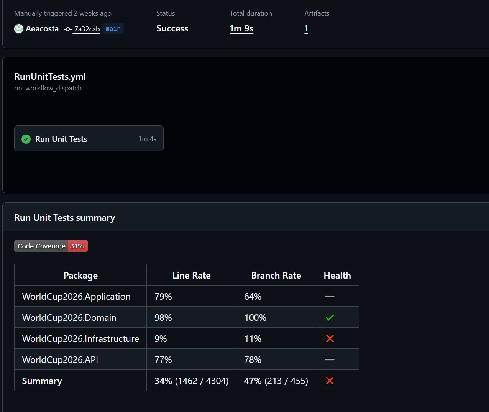

## Docker

Para una buena escalabilidad, se tiene a dispoción una solución Docker. Esta se encarga de levantar las principales aristas de la aplicación: Front End, Back End y Base de Datos.

```yaml
version: '3.8'

services:
  # Backend API Service
  backend:
    build:
      context: ./backend
      dockerfile: Dockerfile
    container_name: worldcup2026-backend
    ports:
      - "5004:5004"
    environment:
      - ASPNETCORE_ENVIRONMENT=Production
      - ASPNETCORE_URLS=http://+:5004
      - ConnectionStrings__DefaultConnection=Data Source=/app/data/WorldCup2026.db
    volumes:
      - backend-data:/app/data
    networks:
      - worldcup-network
    healthcheck:
      test: ["CMD", "curl", "-f", "http://localhost:5004/health"]
      interval: 30s
      timeout: 10s
      retries: 3
      start_period: 40s
    restart: unless-stopped

  # Frontend Service
  frontend:
    build:
      context: ./frontend
      dockerfile: Dockerfile
    container_name: worldcup2026-frontend
    ports:
      - "80:80"
    environment:
      - VITE_API_URL=http://localhost:5004
    depends_on:
      backend:
        condition: service_healthy
    networks:
      - worldcup-network
    healthcheck:
      test: ["CMD", "wget", "--no-verbose", "--tries=1", "--spider", "http://localhost:80/health"]
      interval: 30s
      timeout: 10s
      retries: 3
      start_period: 10s
    restart: unless-stopped

# Named volumes for data persistence
volumes:
  backend-data:
    driver: local

# Network configuration
networks:
  worldcup-network:
    driver: bridge

# Made with Bob
```

```

El siguiente comando va a construir la imagen de Docker y desplegar los contenedores en el servidor.

```bash
docker-compose up --build
```


### Despliegue en Producción

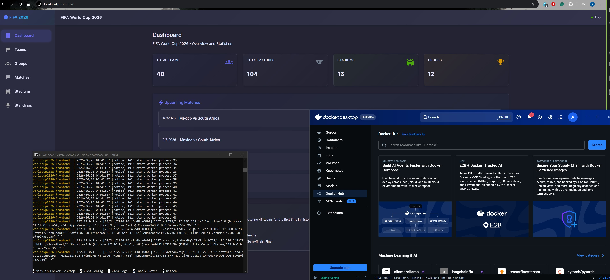

### Documentación

A lo largo de la elaboración de este proyecto, la IA fue de gran aporte para documentar y resumenes ejecutivos el progreso en cada punto del desarrollo.
